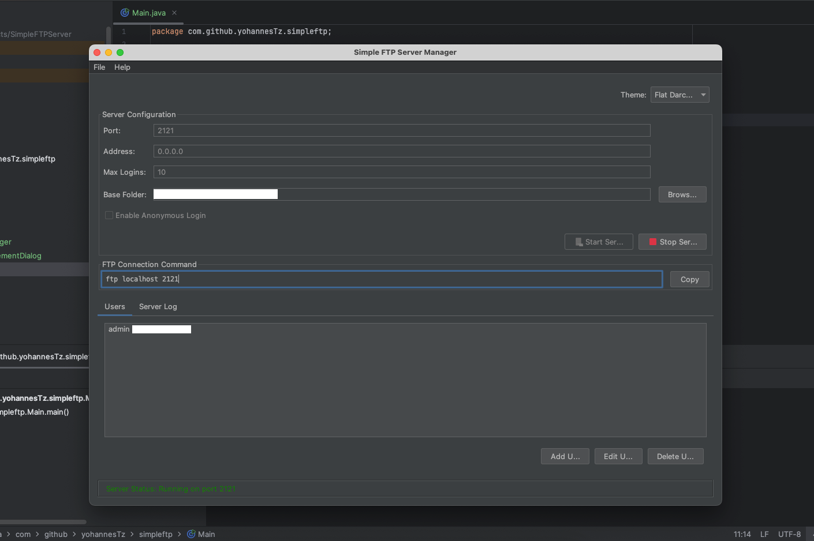
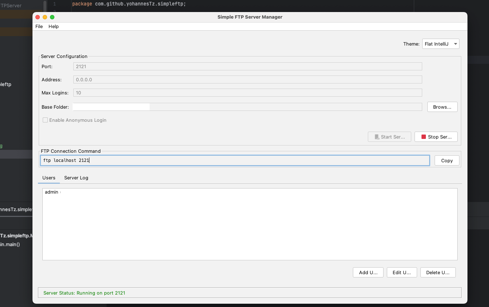
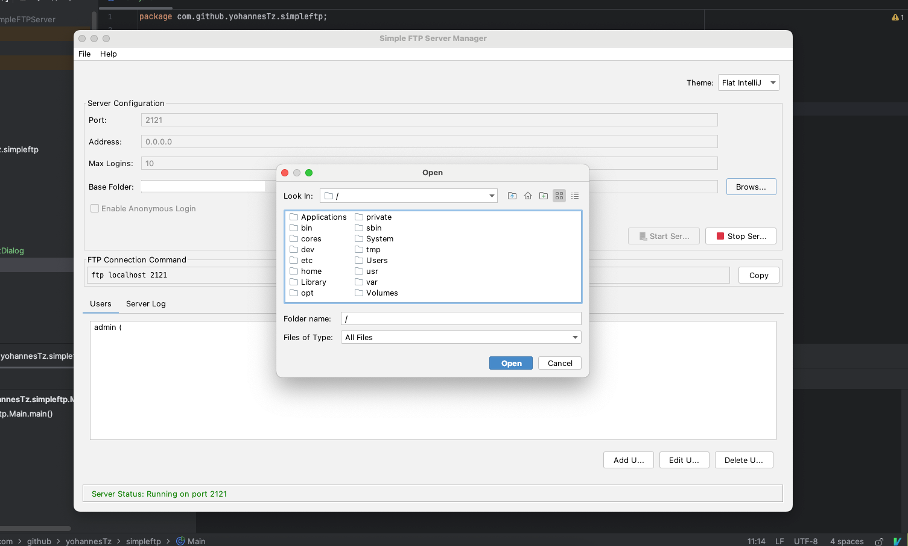
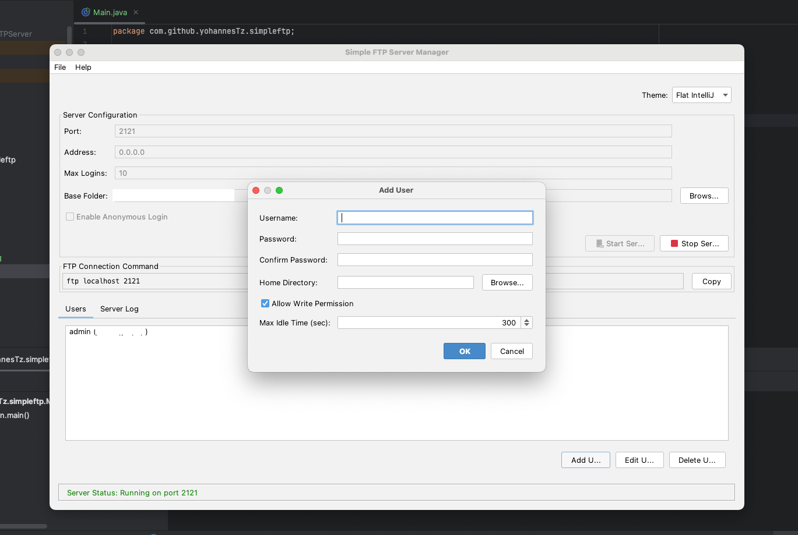
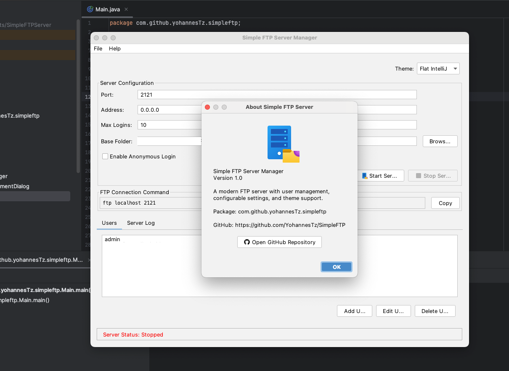

# Simple FTP Server

<div align="center">
  

  <p><strong>YES! a Java Swing app on 2025</strong></p>

[](https://www.oracle.com/java/)
[](LICENSE)
[](https://github.com/YohannesTz/SimpleFTP)
</div>

---

## Screenshots

<div align="center">
<table>
  <tr>
    <td width="33%">
      
    </td>
    <td width="33%">
      
    </td>
    <td width="33%">
      
    </td>
  </tr>
  <tr>
    <td width="50%">
      
    </td>
    <td width="50%">
      
    </td>
  </tr>
</table>
</div>

## Features

- **Granular Permission Management** - Control exactly what each user can do (read, write, delete, rename, create/remove directories, list)
- **User Management** - Add, edit, and delete FTP user accounts with ease
- **Modern UI** - Built with FlatLaf for a clean, modern look
- **Theme Switcher** - Choose from 4 different themes (Light, Dark, IntelliJ, Darcula)
- **Configuration Persistence** - Settings and users are automatically saved and restored
- **Real-time Server Control** - Start/stop the server with a single click
- **Connection Command Display** - Auto-generated FTP connection command with copy button
- **Base Folder Management** - Organize all FTP files in one location
- **Cross-Platform** - Works on Windows, macOS, and Linux

## Quick Start

### Prerequisites

- Java 8 or higher
- Any operating system (Windows, macOS, Linux)

### Running the Application

**Option 1: Using Gradle**

```bash
./gradlew run
```

**Option 2: Using Portable JAR**

```bash
# Download the latest release
java -jar SimpleFTPServer-1.0-portable.jar
```

**Option 3: Using Scripts**

```bash
./run.sh        # Linux/Mac
run.bat         # Windows
```

### First Time Setup

1. Launch the application
2. Default credentials: `admin` / `admin`  **Change this immediately!**
3. Click **"Start Server"** to begin
4. Connect with any FTP client to `localhost:2121`

---

## Usage Guide

### Starting the Server

1. Configure port and settings (optional)
2. Click **"Start Server"**
3. Server status shows "Running" in green
4. Copy the FTP connection command for easy sharing

### Managing Users

1. Go to the **"Users"** tab
2. Click **"Add User"** to create new accounts
3. Configure:
   - Username and password (with confirmation)
   - Home directory (with browse button)
   - Max idle time
   - **Granular Permissions:**
     - Read Files - Download files
     - Write/Upload Files - Upload new or overwrite existing files
     - Delete Files - Remove files
     - Rename Files - Rename files and directories
     - Create Directories - Make new folders
     - Remove Directories - Delete folders
     - List Directories - View directory contents
4. Use **Quick Presets** for common permission configurations:
   - **Full Access** - All permissions enabled
   - **Read Only** - Read and list only
   - **Upload Only** - Read, write, list, and create directories
5. Click **"OK"** to save the user

### Connecting to Your Server

**Command Line FTP:**

```bash
ftp localhost 2121
# Username: admin
# Password: admin
```

**FileZilla:**

- Host: `localhost` or your server IP
- Port: `2121`
- Username: `admin`
- Password: `admin`
- Protocol: FTP (not SFTP)

### Changing Themes

1. Click **"Theme"** dropdown (top-right)
2. Select your preferred theme:
    - **Flat Light** - Bright, professional
    - **Flat Dark** - Easy on the eyes
    - **Flat IntelliJ** - Developer-friendly
    - **Flat Darcula** - Popular dark theme
3. Theme applies instantly and is saved automatically

### Configuration Persistence

All settings are automatically saved to `~/.simpleftp/`:

- Server configuration
- User accounts
- Theme preference

Use **File → Save Configuration** for manual save.  
Use **File → Reset to Defaults** to start fresh.

---

## Building from Source

### Build Requirements

- JDK 8 or higher
- Gradle (included via wrapper)

### Build Commands

**Compile and Build:**

```bash
./gradlew build
```

**Build Portable JAR:**

```bash
./build-portable.sh        # Linux/Mac
build-portable.bat         # Windows
```

The portable JAR will be created at:

```
build/libs/SimpleFTPServer-1.0-portable.jar
```

### Project Structure

```
SimpleFTPServer/
├── src/main/java/com/github/yohannesTz/simpleftp/
│   ├── config/              # Configuration management
│   ├── model/               # Data models
│   ├── server/              # FTP server logic
│   ├── ui/                  # User interface
│   └── Main.java            # Application entry point
├── src/main/resources/
│   ├── ftp-server-48.png    # Application icons
│   ├── ftp-server-96.png
│   └── github-48.png
├── build.gradle             # Build configuration
└── README.md               # This file
```

---

## Permission Management Details

The application supports 7 distinct permissions that can be configured per user:

| Permission           | FTP Commands        | Description                                    |
|---------------------|---------------------|------------------------------------------------|
| **Read Files**      | RETR, SIZE          | Download files from the server                 |
| **Write/Upload**    | STOR, APPE          | Upload new files or overwrite existing ones    |
| **Delete Files**    | DELE                | Remove files from the server                   |
| **Rename**          | RNFR, RNTO          | Rename files and directories                   |
| **Create Directory**| MKD, XMKD           | Create new directories                         |
| **Remove Directory**| RMD, XRMD           | Delete directories                             |
| **List**            | LIST, NLST, MLSD    | View directory contents                        |

### Permission Presets

For convenience, three quick presets are available:

- **Full Access**: All permissions enabled - suitable for administrators
- **Read Only**: Read and list only - suitable for viewers or downloaders
- **Upload Only**: Read, write, list, and create directories - suitable for content uploaders

## Technology Stack

| Technology            | Version | Purpose                              |
|-----------------------|---------|--------------------------------------|
| **Java**              | 8+      | Programming language                 |
| **Apache FTP Server** | 1.2.0   | FTP protocol implementation          |
| **FlatLaf**           | 3.2.5   | Modern Swing look and feel           |
| **SLF4J**             | 2.0.9   | Logging framework                    |
| **Gradle**            | 8.13    | Build system & dependency management |

---

## Configuration

### Default Settings

```
Port:              2121
Address:           0.0.0.0 (all interfaces)
Max Logins:        10
Base Folder:       ~/ftp
Anonymous Login:   Disabled
Theme:             Flat Light
```

### Configuration Files

Located at `~/.simpleftp/`:

- `config.properties` - Server settings and preferences
- `users.dat` - User account information (binary)

### Command Line Options

Run with custom JVM options:

```bash
# More memory
java -Xmx512m -jar SimpleFTPServer-1.0-portable.jar

# Custom theme
java -Dsun.java2d.opengl=true -jar SimpleFTPServer-1.0-portable.jar
```

---

## Security Considerations

**Important Security Notes:**

1. **Change Default Password**: The default `admin/admin` credentials should be changed immediately
2. **Use Strong Passwords**: Enforce complex passwords for all accounts
3. **Firewall Configuration**: Restrict access to trusted IP addresses
4. **Non-Standard Ports**: Consider using ports other than 21 to reduce attacks
5. **Local Network Only**: For testing, bind to `127.0.0.1` instead of `0.0.0.0`
6. **Regular Updates**: Keep dependencies up to date

**Current Limitations:**

- Plain FTP only (no TLS/SSL support)
- Passwords stored locally in binary format
- No built-in encryption for data transfer

---

## Troubleshooting

### Server Won't Start

**Problem**: "Port already in use"  
**Solution**: Change to a different port or stop the conflicting service

**Problem**: "Permission denied"  
**Solution**: Use a port > 1024 or run with elevated privileges

### Can't Connect

1. Verify server status shows "Running"
2. Check firewall settings
3. Ensure correct host and port
4. Try `localhost` first before remote connections

### Configuration Not Saved

**Problem**: Settings reset after restart  
**Solution**: Check file permissions on `~/.simpleftp/` directory

**Problem**: Configuration corrupt  
**Solution**: Use **File → Reset to Defaults** or delete `~/.simpleftp/`


## License

This project is licensed under the MIT License - see the [LICENSE](LICENSE) file for details.

### Third-Party Licenses

- **Apache FTP Server** - Apache License 2.0
- **FlatLaf** - Apache License 2.0
- **SLF4J** - MIT License


### ⭐ Show Your Support

Give a ⭐ if this project helped you!
